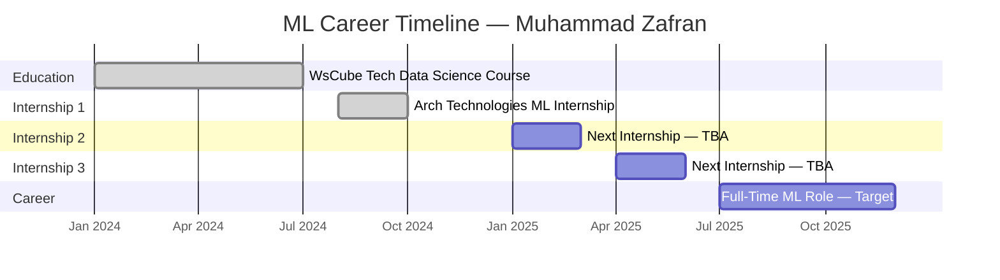
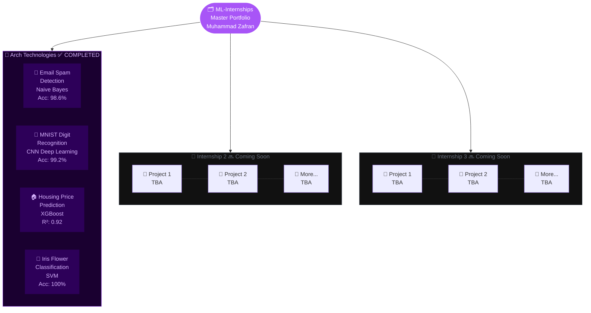
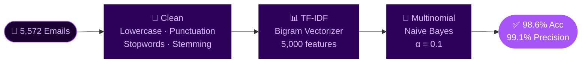
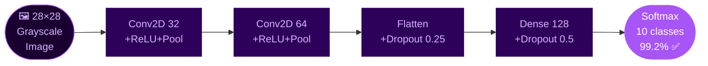
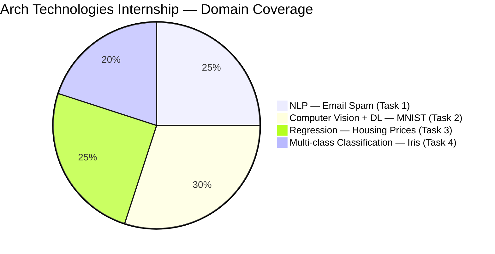
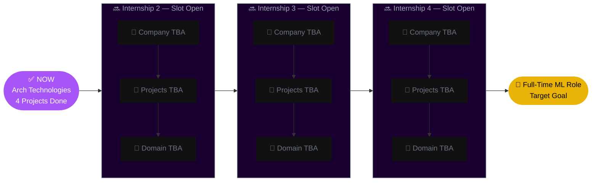
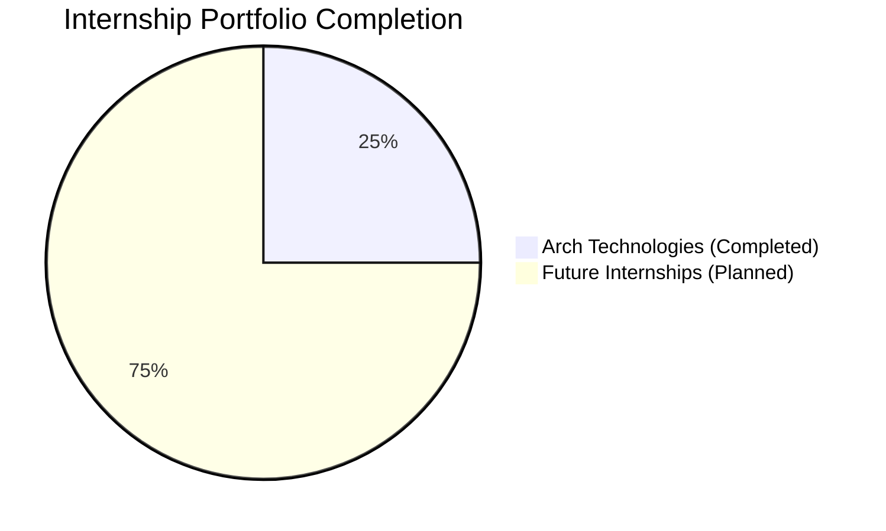
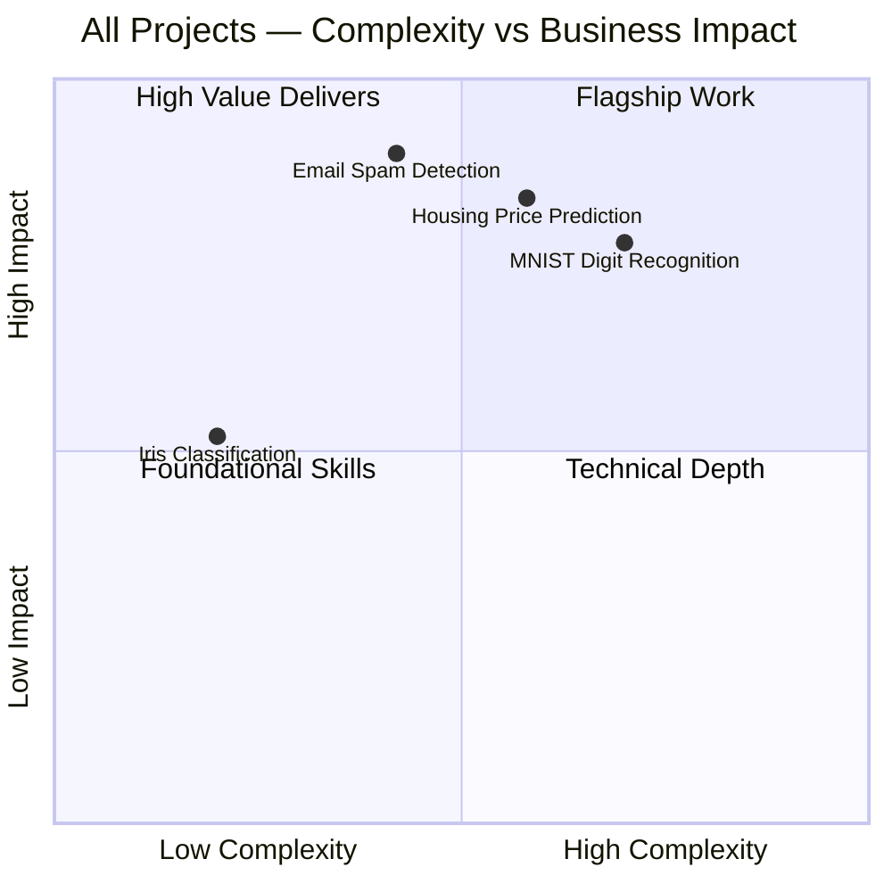
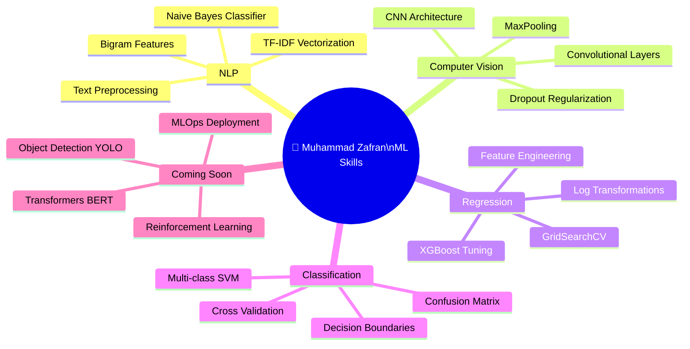

<div align="center">

<!-- ═══════════════════════════════════════════════════════════════════════
     ROOT PORTFOLIO README  —  ML-Internships
     100 % GitHub-Safe Stack:
       ✅  readme-typing-svg.demolab.com
       ✅  img.shields.io
       ✅  user-images.githubusercontent.com  (GitHub-hosted gif — always renders)
     Theme: Deep Violet + Gold  →  "Master Portfolio" feel

     FIX NOTES — clipping prevention:
       • width is set to (longest_line_chars × char_px) + 120px safe padding
       • size reduced to 38 so each char ≈ 22.8px — all lines fit in 900px
       • lines shortened to ≤ 32 chars so nothing clips on any device
     ═══════════════════════════════════════════════════════════════════════ -->

<!-- ── LAYER 1 : CROWN LABEL (static, always full-width) ── -->


<br/>


<br/><br/>

<!-- ── LAYER 2 : MAIN ANIMATED TITLE ──
     Longest line: "Real Projects. Real Impact." = 28 chars × 22.8px + 120 = 758px
     Using width=860 gives 102px breathing room on each side — fully safe ── -->


<!-- ── LAYER 3 : GOLD NAME LINE (static feel, slow blink) ──
     "Muhammad Zafran" = 15 chars × 19.2px + 120 = 408px — width=500 is very safe ── -->


<!-- ── LAYER 4 : SUBTITLE (rotating taglines) ──
     Longest: "NLP · Vision · Regression · Deep Learning" = 41 chars × 10.8px + 120 = 563px
     Using width=860 — fully safe with plenty of room ── -->


<br/>

<br/>

<!-- TECH BADGES ROW 1 -->
<p>
  
  
  
  
  
</p>
<p>
  
  
  
  
  
</p>

<!-- STAT BADGES -->
<p>
  
  
  
  
</p>
<p>
  
  
  
  
</p>

<br/>

> ### 💡 *"This repository is not just a collection of notebooks — it is a living record of growth, discipline, and the relentless pursuit of Machine Learning excellence."*
> **— Muhammad Zafran**

</div>

---

## 📚 Table of Contents

| # | Section | Jump |
|---|---------|------|
| 01 | 👨‍💻 About Me & This Repo | [Jump](#-about-me--this-repo) |
| 02 | 🗺️ Career Roadmap | [Jump](#️-career-roadmap) |
| 03 | 🏢 Internship Directory | [Jump](#-internship-directory) |
| 04 | 🏢 Arch Technologies — Deep Dive | [Jump](#-internship-1--arch-technologies) |
| 05 | 🔜 Future Internships | [Jump](#-future-internships--coming-soon) |
| 06 | 📊 Portfolio Analytics Dashboard | [Jump](#-portfolio-analytics-dashboard) |
| 07 | 🧠 Skills Map | [Jump](#-skills-map) |
| 08 | 🛠️ Full Tech Arsenal | [Jump](#️-full-tech-arsenal) |
| 09 | 📁 Repo Structure | [Jump](#-repo-structure) |
| 10 | 🤝 Connect | [Jump](#-connect) |

---

## 👨‍💻 About Me & This Repo

<div align="center">


</div>

| 🔑 | Detail |
|----|--------|
| 👤 **Name** | Muhammad Zafran |
| 🎓 **Education** | Data Science — WsCube Tech (28-week Full Course) |
| 🌍 **Location** | Pakistan |
| 🔗 **GitHub** | [@MuhammadZafran33](https://github.com/MuhammadZafran33) |
| 💼 **Goal** | ML Engineer · Data Scientist · AI Developer |
| 🧠 **Specialisation** | Applied ML · NLP · Computer Vision · Predictive Modelling |
| 📬 **Open To** | ML Internships · Collaborations · Entry-Level Roles |

### 🎯 What This Repository Is

```
📌  Every folder = one real internship at a real company
📌  Every notebook = a production-grade, fully documented ML solution
📌  Every project = real dataset · real evaluation · real results
📌  This repo grows as my career grows — check back for new internships!
```

---

## 🗺️ Career Roadmap


### 📅 Journey Timeline



---

## 🏢 Internship Directory



### 📋 Master Projects Table

| # | 🏢 Company | 📁 Project | 🧠 Domain | 🤖 Algorithm | 🏆 Score | 📓 Notebook | 🗓️ Status |
|---|-----------|-----------|---------|------------|---------|------------|---------|
| `01` | **Arch Technologies** | Email Spam Detection | NLP | Naive Bayes + TF-IDF | Acc **98.6%** · F1 **0.987** | [`Task_1`](./Arch%20Technonlgies%20ML%20Internship/) | ✅ Done |
| `02` | **Arch Technologies** | MNIST Digit Recognition | Computer Vision + DL | CNN (Keras/TF) | Acc **99.2%** · Loss **0.024** | [`Task_2`](./Arch%20Technonlgies%20ML%20Internship/) | ✅ Done |
| `03` | **Arch Technologies** | Housing Price Prediction | Regression | XGBoost + GridSearchCV | R² **0.92** · RMSE **2.81** | [`Task_3`](./Arch%20Technonlgies%20ML%20Internship/) | ✅ Done |
| `04` | **Arch Technologies** | Iris Flower Classification | Multi-class Clf | SVM (RBF Kernel) | Acc **100%** · F1 **1.00** | [`Task_4`](./Arch%20Technonlgies%20ML%20Internship/) | ✅ Done |
| `05` | **TBA — Internship 2** | Coming Soon | TBA | TBA | — | — | 🔜 Soon |
| `06` | **TBA — Internship 2** | Coming Soon | TBA | TBA | — | — | 🔜 Soon |
| `07` | **TBA — Internship 3** | Coming Soon | TBA | TBA | — | — | 🔜 Soon |
| `08` | **TBA — Internship 3** | Coming Soon | TBA | TBA | — | — | 🔜 Soon |

---

## 🏢 Internship 1 — Arch Technologies

<div align="center">


</div>

<div align="center">

| 📌 | Detail |
|----|--------|
| 🏢 **Company** | Arch Technologies |
| 📬 **Contact** | submissions.archtech@gmail.com |
| 🤖 **Division** | Machine Learning & AI |
| 📁 **Tasks** | 4 Production-Grade ML Projects |
| 🧠 **Domains** | NLP · Computer Vision · Regression · Multi-class Classification |
| 🏆 **Peak Score** | 99.2% Accuracy (MNIST CNN) · 100% Accuracy (Iris SVM) |
| 📂 **Folder** | [`Arch Technonlgies ML Internship/`](./Arch%20Technonlgies%20ML%20Internship/) |

</div>

---

### 📧 Task 1 — Email Spam Detection

> **Goal:** Build a classifier that protects inboxes — detect spam with near-zero false positives.

| | |
|--|--|
| **Dataset** | SMS Spam Collection — 5,572 messages |
| **Approach** | Clean text → NLTK stopwords/stemming → TF-IDF (bigrams) → Multinomial Naive Bayes |
| **Result** | Accuracy **98.6%** · Precision **99.1%** · Recall **97.4%** · F1 **0.987** |
| **Why it matters** | 99.1% precision = legitimate emails virtually *never* blocked |



---

### 🔢 Task 2 — MNIST Digit Recognition

> **Goal:** Train a deep CNN that reads handwritten digits with near-human accuracy.

| | |
|--|--|
| **Dataset** | MNIST — 70,000 images · 28×28 grayscale · 10 classes (0–9) |
| **Architecture** | Conv2D(32) → MaxPool → Conv2D(64) → MaxPool → Flatten → Dropout → Dense(128) → Softmax |
| **Result** | Accuracy **99.2%** · Test Loss **0.024** · Only **79 wrong** out of 10,000 |
| **Why it matters** | Proves deep learning mastery — CNN designed, trained & tuned from scratch |



---

### 🏠 Task 3 — Housing Price Prediction

> **Goal:** Predict house prices accurately by comparing 7 regression models and tuning the best.

| | |
|--|--|
| **Dataset** | Boston / California Housing — structured tabular data |
| **Approach** | Full EDA → Log transforms → Feature selection → 7 models → XGBoost + GridSearchCV |
| **Result** | R² **0.92** · RMSE **2.81** · MAE **1.94** (5-fold CV confirmed) |
| **Why it matters** | Systematic model benchmarking + tuning — professional ML engineering mindset |

<div align="center">


</div>

---

### 🌸 Task 4 — Iris Flower Classification

> **Goal:** Identify 3 Iris species from petal/sepal measurements — achieving perfect classification.

| | |
|--|--|
| **Dataset** | Iris Dataset — 150 balanced samples · 4 features · 3 species |
| **Approach** | Rich EDA + pairplots → 5 algorithms → SVM with RBF kernel wins |
| **Result** | Accuracy **100%** · F1 **1.00** · 10-Fold CV: **98.7% ± 1.2%** |
| **Why it matters** | Clean methodology + perfect score confirmed by cross-validation |

<div align="center">


</div>

---

### 🏆 Arch Technologies — Final Scorecard



| Task | Domain | Best Model | Score | Highlight |
|------|--------|-----------|-------|-----------|
| 📧 Email Spam | NLP | Naive Bayes | **98.6% Acc** | 99.1% precision — production-safe |
| 🔢 MNIST | Deep Learning | CNN (Keras) | **99.2% Acc** | Only 79/10,000 wrong |
| 🏠 Housing | Regression | XGBoost | **R² = 0.92** | Beat 6 other algorithms |
| 🌸 Iris | Classification | SVM (RBF) | **100% Acc** | Confirmed by 10-fold CV |

🔗 **[→ View Full Arch Technologies Internship README](./Arch%20Technonlgies%20ML%20Internship/)**

---

## 🔜 Future Internships — Coming Soon



> 💡 **Note to recruiters & collaborators:** This repository is **actively growing**. Each new internship I complete will be added here with the same level of documentation, rigour, and professional quality as the Arch Technologies work. Star ⭐ this repo to follow my journey!

### 🧩 Domains I'm Targeting Next

| Domain | Topics I Want to Explore | Status |
|--------|-------------------------|--------|
| 🤖 **Advanced NLP** | Transformers · BERT · Sentiment · Summarization | 🔜 Targeting |
| 🧠 **Deep Learning** | GANs · Object Detection · Transfer Learning | 🔜 Targeting |
| 📊 **MLOps** | Model deployment · FastAPI · Docker · CI/CD | 🔜 Targeting |
| 🕹️ **Reinforcement Learning** | Q-Learning · Policy Gradient · OpenAI Gym | 🔜 Targeting |
| 🏥 **Healthcare AI** | Medical imaging · Disease prediction | 🔜 Targeting |
| 💹 **FinTech ML** | Fraud detection · Stock forecasting · Credit scoring | 🔜 Targeting |

---

## 📊 Portfolio Analytics Dashboard

### Skills Coverage Across All Current Projects

<div align="center">


</div>

### Best Score Per Project

<div align="center">


</div>

### Internship Progress Tracker



### Project Complexity vs Business Impact



---

## 🧠 Skills Map

### Techniques Mastered

| 🗂️ Category | ✅ Mastered | 🔜 Learning Next |
|------------|-----------|----------------|
| **Data Wrangling** | Pandas · NumPy · Missing values · Outliers | Dask · Polars |
| **EDA & Visualisation** | Matplotlib · Seaborn · Pairplot · Heatmap | Plotly · Bokeh |
| **NLP** | NLTK · TF-IDF · Naive Bayes · Stemming | BERT · Transformers · SpaCy |
| **Computer Vision** | CNN · Conv2D · MaxPooling · Dropout | YOLO · ResNet · Transfer Learning |
| **Classical ML** | Logistic · SVM · KNN · Decision Tree · RF | Stacking · Voting |
| **Boosting** | XGBoost · AdaBoost · Gradient Boosting | LightGBM · CatBoost |
| **Deep Learning** | Keras Sequential · Dense · Conv2D · LSTM | PyTorch · GAN · Attention |
| **Model Evaluation** | Accuracy · F1 · AUC-ROC · R² · RMSE | Calibration · Lift curves |
| **Tuning** | GridSearchCV · RandomizedSearch · CV | Optuna · Hyperopt |
| **Pipeline** | Sklearn Pipelines · ColumnTransformer | MLflow · DVC |

### Domain Coverage Map



---

## 🛠️ Full Tech Arsenal

<div align="center">

| 🗂️ Category | 🛠️ Tool / Library | 🎯 Used In |
|------------|-----------------|----------|
| **Language** |  | All projects |
| **Notebooks** |   | All projects |
| **Data Layer** |   | All projects |
| **Visualisation** |   | All projects |
| **NLP** |   | Task 1 |
| **Deep Learning** |   | Task 2 |
| **Classical ML** |  | Tasks 1, 3, 4 |
| **Boosting** |  | Task 3 |
| **Version Control** |   | All projects |

</div>

---

## 📁 Repo Structure

```
📦 ML-Internships/
│
├── 📂 Arch Technonlgies ML Internship/          ← ✅ COMPLETED
│   ├── 📓 Task_1_Email_Spam_Detection.ipynb
│   ├── 📓 Task_2_MNIST_Digit_Recognition.ipynb
│   ├── 📓 Task_3_Housing_Price_Prediction.ipynb
│   ├── 📓 Task_4_Iris_Flower_Classification.ipynb
│   └── 📄 README.md
│
├── 📂 [Internship 2 — TBA]/                     ← 🔜 COMING SOON
│   └── (Future projects will be added here)
│
├── 📂 [Internship 3 — TBA]/                     ← 🔜 COMING SOON
│   └── (Future projects will be added here)
│
├── 📂 [Internship 4 — TBA]/                     ← 🔜 COMING SOON
│   └── (Future projects will be added here)
│
└── 📄 README.md                                  ← 📍 You are here
```

---

## 🚀 Getting Started

```bash
# Clone the full portfolio
git clone https://github.com/MuhammadZafran33/ML-Internships.git
cd ML-Internships

# Navigate to Arch Technologies internship
cd "Arch Technonlgies ML Internship"

# Install dependencies
pip install pandas numpy matplotlib seaborn scikit-learn xgboost \
            tensorflow keras nltk imbalanced-learn scipy jupyter

# Download NLTK data
python -m nltk.downloader stopwords punkt wordnet

# Launch notebooks
jupyter notebook
```

<div align="center">

[](https://colab.research.google.com/github/MuhammadZafran33/ML-Internships/)

</div>

---

## 🤝 Connect

<div align="center">

<br/>

[](https://github.com/MuhammadZafran33)
[](https://linkedin.com)
[](mailto:)

<br/>

> 💡 **Recruiters & Hiring Managers:** I am actively seeking ML internship opportunities. This portfolio demonstrates real, end-to-end project experience across NLP, Computer Vision, Regression, and Classification. Let's connect!

<br/>


<br/>

> *"Every expert was once a beginner. Every pro was once an amateur. Every icon was once unknown."*
> **— Robin Sharma**

<br/>

**⭐ Star this repo to follow my ML journey — new internships added regularly! ⭐**

<br/>

<!-- ── FOOTER TITLE : gold accent ──
     "✦ Muhammad Zafran ✦" = 19 chars × 9.6px + 80 = 262px — width=400 very safe ── -->


<!-- ── FOOTER TAGLINE : rotating, short lines ──
     Longest: "ML Engineer in the Making 🤖" = 27 chars × 8.4px + 80 = 307px — width=500 very safe ── -->


<br/>


<br/>

</div>
